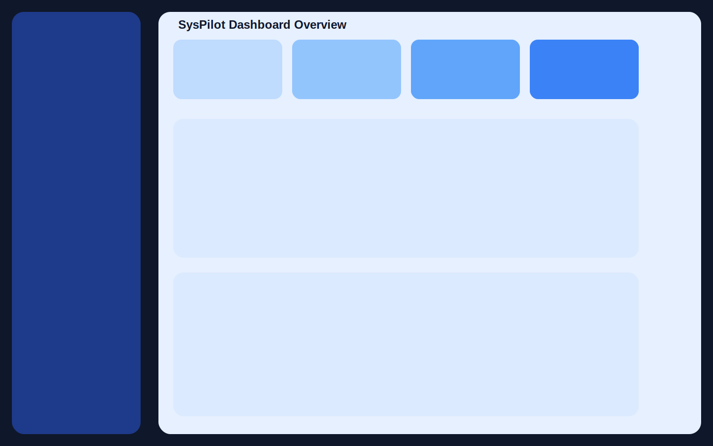
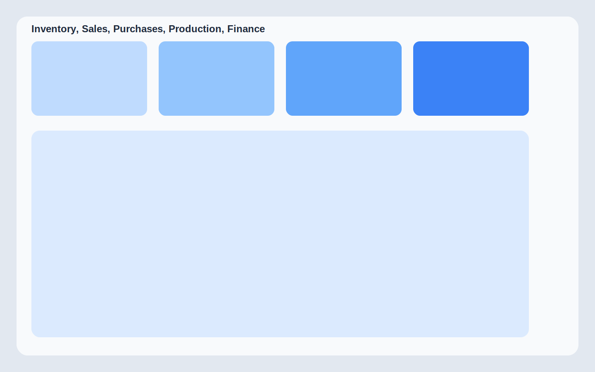
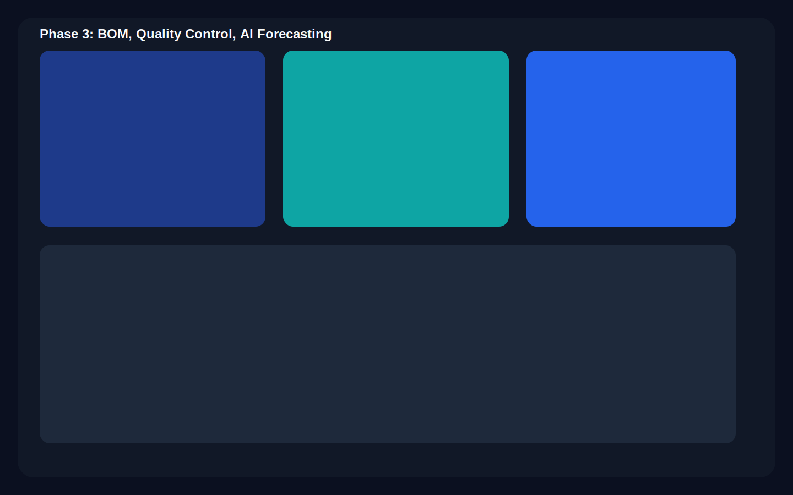

# SysPilot

SysPilot is an AI-powered ERP built with Next.js App Router + Supabase.

## Prerequisites

- Node.js 20+
- pnpm
- Supabase project (URL + anon key)

## Environment Variables

Set these in `.env.local`:

```bash
NEXT_PUBLIC_SUPABASE_URL=your_supabase_project_url
NEXT_PUBLIC_SUPABASE_ANON_KEY=your_supabase_anon_key
```

Optional seed user overrides:

```bash
SEED_ADMIN_EMAIL=admin@syspilot.dev
SEED_ADMIN_PASSWORD=SysPilot#2026
SEED_ADMIN_FULL_NAME=SysPilot Admin
```

## Install + Run

```bash
pnpm install
pnpm dev
```

## Supabase Setup

Apply SQL migrations in order from:

- `supabase/migrations/20260314000000_initial_schema.sql`
- `supabase/migrations/20260314133500_auth_profile_alignment.sql`

## Seed Demo Data

```bash
pnpm seed
```

This creates or reuses a seed admin user and inserts idempotent demo data for:

- company, profile, and 3 facilities
- 20 suppliers and 50 customers
- 100 unique products
- 100 sales orders + 100 purchase orders + 100 work orders
- BOM headers + component lines
- transaction, quality inspection, demand forecast

## Screenshots

### Dashboard Overview



### Core Operations Modules



### Advanced Modules



## Auth Routes

- `GET /auth/callback`
- `/login`
- `/signup`
- protected dashboard routes under `src/app/(dashboard)`
